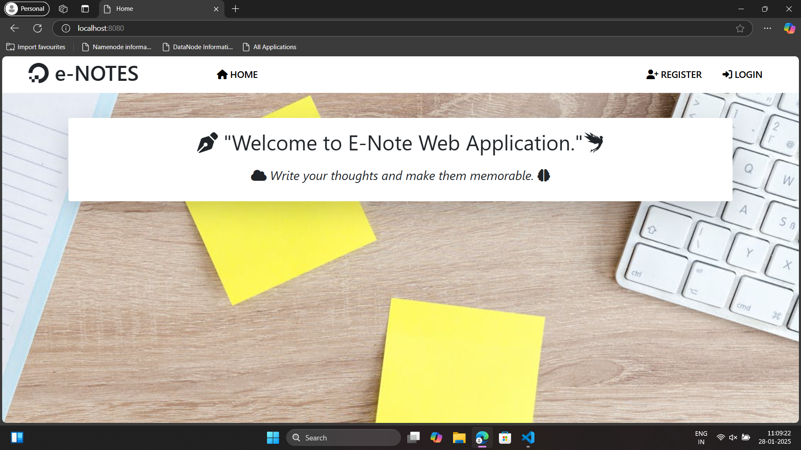

# 📚 eNotes Web Application

## ✍️ Project Description

eNotes is a web application designed to simplify and organize note-taking for users. Built with the **Spring Framework**, **MySQL**, and **Thymeleaf**, the application provides an intuitive interface for creating, updating, and managing personal notes.

## 🚀 Features

- **User Authentication**: Secure login and signup functionality.
- **CRUD Operations**: Create, read, update, and delete notes with ease.
- **Responsive Design**: Optimized for both desktop and mobile devices using Thymeleaf templates.

## 🖂️ Project Structure

```plaintext
├── src/
│   ├── main/
│   │   ├── java/
│   │   │   ├── com.enotes/
│   │   │       ├── controller/     # Handles HTTP requests
│   │   │       ├── service/        # Business logic
│   │   │       ├── repository/     # Database interaction
│   │   │       ├── model/          # Entity classes
│   │   │       ├── config/         # Security and app configurations
│   │   ├── resources/
│   │   │   ├── templates/              # Thymeleaf HTML templates
│   │   │   ├── static/                 # CSS, JS, and image files
│   │   │   ├── application.properties  # App configurations
├── pom.xml                         # Maven dependencies
└── README.md                       # Project documentation
```

## ⚙️ Technologies Used

- **Backend**: Spring Framework (Spring Boot, Spring MVC, Spring Data JPA, Spring Security)
- **Frontend**: Thymeleaf, HTML, CSS, BootStrap 5
- **Database**: MySQL
- **Build Tool**: Maven

## 🛠️ Installation and Setup

1. Clone the repository:
   ```bash
   git clone https://github.com/your-username/enotes-webapp.git
   ```
2. Navigate to the project directory:
   ```bash
   cd enotes-webapp
   ```
3. Configure the database:
   - Create a MySQL database named `enotes` (or update the `application.properties` file with your database name and credentials).
   - Run the SQL scripts (if any) to initialize the database schema.
4. Update `application.properties`:
   ```properties
   spring.datasource.url=jdbc:mysql://localhost:3306/enotes
   spring.datasource.username=your-username
   spring.datasource.password=your-password
   ```
5. Build and run the application:
   ```bash
   mvn spring-boot:run
   ```
6. Access the app in your browser at `http://localhost:8080`.

## ✨ Features Overview

1. **User Registration & Login**:
   - Secure user authentication and session management with Spring Security.

2. **Note Management**:
   - Add, edit, delete, and view notes.
   - User Separation.

3. **Responsive Design**:
   - Thymeleaf templates provide a seamless experience on all devices.

## 🔒 Security

- Password encryption using **BCrypt**.
- CSRF protection enabled.
- Role-based access control (Admin/User).

## 🎨 Screenshots

### Home Page.
- 

### Registration Page.
-  

### Log in Page.
-  

### Adding Notes.
-  

### View/Edit/Delete Notes.
-  

## 🤝 Contributing

Contributions are welcome! Feel free to fork this repository, work on new features, and open a pull request.

## 📜 License

This project is licensed under the [Your License Name] - see the [LICENSE](LICENSE) file for details.

## 📧 Contact

For any queries, feel free to reach out:
- **Name**: Nikhil Keshri
- **Email**: nikhilkeshri2213@gmail.com
